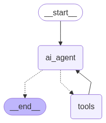

# Weather Activity Clothing Assistant - Documentation

## 🧠 Overview

This project is an intelligent, LLM-powered assistant that answers user queries about:

* 🌦️ Current weather conditions
* 👕 Personalized clothing suggestions
* 🏃‍♂️ Suitable outdoor activities

...based on the user's location, real-time weather data, and a vectorized knowledge base extracted from a detailed global guide.

It integrates:

* ✅ OpenWeatherMap API for weather data
* ✅ Groq LLM for function calling and natural language understanding
* ✅ Cohere Rerank and HuggingFace embeddings for semantic search
* ✅ Cassandra vector database (via Cassio)
* ✅ Streamlit chat UI for user interaction

---

## ⚙️ System Components

### 1. `WeatherActivityClothingAgent` (Core Class)

This class defines the full logic of the assistant, including:

* Loading API keys from `.env`
* Initializing OpenWeatherMap, LLM, and vector DB
* Defining the function tools:

  * `weather_query(location)` → returns weather info from API
  * `retrieve_weather_activity_clothing_info` → returns clothing/activity suggestions from vector DB
* Using `LangGraph` to manage tool execution and response flow

📄 **Prompt Design:**
A multi-step prompt tells the LLM how to:

* Decide which tool to call
* Handle missing location info
* Combine outputs into friendly responses

### 2. Tool Definitions

```python
@tool
def weather_query(location: str) -> str:
    return weather.run(location)
```

```python
retriever_tool = create_retriever_tool(
    compression_retriever,
    name="retrieve_weather_activity_clothing_info",
    description=(
        "This tool retrieves contextually relevant and compressed information about recommended outdoor activities "
        "and appropriate clothing based on current weather conditions and location. "
        "It leverages a comprehensive global guide covering multiple weather scenarios—such as sunny, rainy, snowy, "
        "windy, cloudy, hot, and cold conditions—tailored for diverse countries including Egypt, UK, USA, Japan, and Australia. "
        "The recommendations ensure users get personalized, climate-specific advice for comfort and safety during outdoor plans."
    )
)
```

### 3. Vector Store Setup

* Loader: 
* Splitting: Custom splitters for each weather section
* Embedding: `all-mpnet-base-v2`
* Search: Cassandra vector DB + Cohere rerank (top 4 chunks)

---

## 🔁 Workflow Overview

Here’s how the full workflow is executed:



This image shows the flow between nodes:

* Starts at `__start__`
* Proceeds to `ai_agent`
* Depending on the tool selected, goes to `tools` or ends
* Returns to `ai_agent` after tool execution if needed

For text-based explanation of the system logic, refer to the section below or the prompt logic in the agent class.

---

## 💬 Streamlit Chat UI (`app.py`)

An interactive front-end for users to ask natural questions.
Features include:

* Chat history by session
* Custom chat bubbles
* Automatic tool invocation via agent stream
* Option to clear or start new chat

### Minimal Usage

```python
from agent import WeatherActivityClothingAgent
agent = WeatherActivityClothingAgent()
agent("What should I wear in Cairo?")
```

### UI Preview

```
User: What should I wear in London?
🤖 Assistant: It's currently 12°C and rainy. Recommended clothing: waterproof jacket and boots. Activity: Visit a cozy indoor café.
```

---

## 🧪 Development & Testing

Multiple prototypes were tested, including:

* Direct usage of `create_react_agent`
* Manual `invoke()` testing
* Multiple document chunking strategies
* Prompt tuning to balance tool calling

---

## 📦 Setup Instructions

```bash
# 1. Clone the repository
$ git clone git@github.com:amgad2509/VOIS_TASK.git
$ cd VOIS_TASK

# 2. Create virtual environment
$ python -m venv weather_env
$ source weather_env/bin/activate  # Windows: weather_env\Scripts\activate

# 3. Install requirements
$ pip install -r requirements.txt

# 4. Add a .env file with:
GROQ_API_KEY=your_key
OPENWEATHERMAP_API_KEY=your_key
COHERE_API_KEY=your_key
OPENAI_API_KEY=your_key
CASSIO_DB_ID=your_db_id
CASSIO_TOKEN=your_token

# 5. Run the app
$ streamlit run app.py
```

---

## 🧠 How to Get API Keys

### 🌦️ OpenWeatherMap

1. Go to [https://openweathermap.org/api](https://openweathermap.org/api)
2. Sign up for a free account
3. Go to "My API keys" from your dashboard
4. Copy your key and add it to your `.env` as:

```env
OPENWEATHERMAP_API_KEY=your_api_key
```

### 🧠 Cohere API (for semantic reranking)

1. Visit [https://cohere.com/](https://cohere.com/)
2. Create a free account
3. Go to Dashboard → API Keys
4. Add your key to `.env`:

```env
COHERE_API_KEY=your_api_key
```

### 📦 HuggingFace embeddings (no API key needed)

* This project uses the public model: `sentence-transformers/all-mpnet-base-v2`

### 🗃️ Vector Store (Cassio / AstraDB)

1. Go to [https://www.datastax.com/astra](https://www.datastax.com/astra)
2. Create an Astra DB and note:

   * Database ID → `CASSIO_DB_ID`
   * Token → `CASSIO_TOKEN`
3. Add them to `.env` as:

```env
CASSIO_DB_ID=your_db_id
CASSIO_TOKEN=your_token
```

---

## 🛠️ File Structure

```
VOIS_TASK/
├── app.py
├── agent.py
├── requirements.txt
├── .env.example
├── README.md
└── data/
    └── WeatherActivityClothingDatabase.pdf
```

---

## ⚠️ Notes

* Use valid API keys from OpenWeatherMap, Groq, Cohere, and Cassio
* Free API tiers may apply rate limits

---

## 📜 License & Acknowledgments

* Built by \ Amgad Shalaby
* Powered by LangChain, OpenWeatherMap, HuggingFace, Groq, Cassio, and Cohere

---

For more questions or extensions, feel free to contact me.
